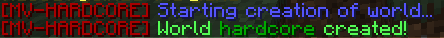
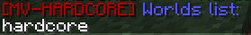
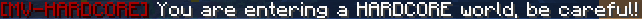

# MultiverseHardcore
[](https://www.spigotmc.org/resources/multiversehardcore-temporary-and-permanent-death-bans.77749/)
[](https://www.spigotmc.org/resources/multiversehardcore-temporary-and-permanent-death-bans.77749/)
[](https://www.spigotmc.org/resources/multiversehardcore-temporary-and-permanent-death-bans.77749/)
[](https://scrutinizer-ci.com/g/lluiscamino/MultiverseHardcore/)
[](https://github.com/lluiscamino/MultiverseHardcore/issues)
[](https://github.com/lluiscamino/MultiverseHardcore)

Minecraft Version: _1.16_

With this plugin, you can prevent your players from entering a world if they die in it.

Deathbans only affect the worlds you choose and can be temporary or permanent.

[Multiverse-Core](https://github.com/Multiverse/Multiverse-Core) is required to use this plugin.

## Installation

1. Install [Multiverse-Core](https://github.com/Multiverse/Multiverse-Core) on your server.
2. Download the JAR file and put it on your Minecraft server ``plugins`` folder.
3. Restart the server.

## Basic usage
After you've successfully installed the plugin, log in to your server and enter the following command:
```
/mvhc create hardcore
```


If everything went well, a Multiverse world called ``hardcore`` will have been created.
Type ``/mv list`` or ``/mvhc worlds`` and you should see the name of your new world.



Teleport to your new Hardcore world using ``/mv tp hardcore`` and you'll see a warning message. Be careful, if you die you won't be able to play in the world again!



For more options when creating a world (temporary bans, respawn world, Nether, The End...) check the command section.

## Commands

### Create a Hardcore world
With this command, you can create a default Multiverse world in your server and make it Hardcore.
```
/mvhc create <world> [spectator_mode] [create_nether] [create_end] [ban_ops] [ban_forever] [ban_length] [include_nether] [include_end] [respawn_world]
```
Options:
* __world__: Name of the world you want to create
* __spectator_mode__ _(Optional)_: Set to true if you want players who die to be put on spectator mode. If set to false, they will be kicked out of the world.
* __create_nether__ _(Optional)_: Set to true if you want to create a Nether for the world. You may need [Multiverse-Netherportals](https://github.com/Multiverse/Multiverse-Core/wiki/Install-%28NetherPortals%29) for your Nether to work.
* __create_end__ _(Optional)_: Same as __create_nether__ but with The End.
* __ban_ops__ _(Optional)_: Set to false if you don't want OPs to be banned if they die.
* __ban_forever__ _(Optional)_: Set to true to make the deathban permanent.
* __ban_length__ _(Optional)_: Death ban length (in seconds). If __ban_forever__ is set to true, this value doesn't matter.
* __include_nether__ _(Optional)_: Set to true if you want your players to be deathbanned in the main world if they die on the Nether. Also, if set to true, players who die on the main world won't be able to play in the Nether.
* __include_end__ _(Optional)_:  Same as __include_nether__ but with The End.
* __respawn_world__ _(Optional)_: Name of the respawn world (this is required if __spectator_mode__ is set to false).

### Make a world Hardcore
Use this command if you already have a world created and want to make it Hardcore.
```
/mvhc makehc <world> [spectator_mode] [ban_ops] [ban_forever] [ban_length] [include_nether] [include_end] [respawn_world]
```
The options are all explained in the previous command.

### Unban player
Use this command to unban a death banned player from a hardcore world
```
/mvhc unban <world> <player>
```

### See player info
Use this command to see information about a player in a Hardcore world:
```
/mvhc player [world] [player]
```
Options:
* __world__ _(Optional)_: Hardcore world. Not necessary if it's the same world you're in.
* __player__ _(Optional)_: Name of player. Not necessary if you want to see your information.

### See Hardcore world information
Use this command to see information about a Hardcore world:
```
/mvhc world [world]
```
Options:
* __world__ _(Optional)_: Hardcore world. Not necessary if it's the same world you're in.
### See Hardcore worlds list
Use this command to get a list of all Hardcore worlds in your server:
```
/mvhc worlds
```

### See plugin version
```
/mvhc version
```
